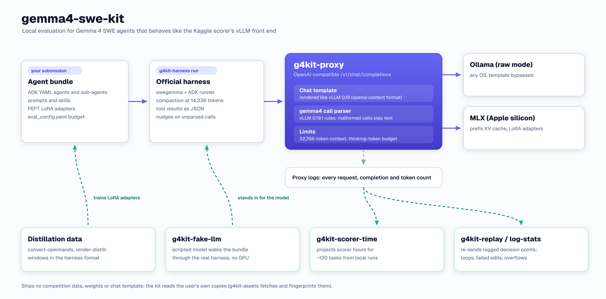

# gemma4-swe-kit

[](https://github.com/damsolanke/gemma4-swe-kit/actions/workflows/ci.yml)

Local evaluation tools that reproduce the Kaggle "Gemma 4 Developer Agent" scorer (vLLM 0.19, Gemma 4 31B QAT, 4x L4) closely enough that prompts, call parsing, context limits and thinking budgets behave as on the scorer: a vLLM-like proxy over Ollama or MLX, a scorer-time estimator, a GPU-free harness smoke test and replay experiments. For LoRA distillation it converts, curates and renders teacher trajectories, trains adapters on Apple Silicon (MLX) or a free Kaggle TPU, and checks them twice: PEFT key names against the model tree, then a logit canary against the vLLM server that serves them.

<p align="center"></p>

## Why

A typical local setup puts the agent in front of Ollama or LM Studio, which bring their own chat rendering and tool-call parsing. Those servers skip several things the scorer does, and each gap changes what the agent sees or how a task ends:

| What the scorer does | What a plain local server does | Covered by |
|---|---|---|
| Renders each request with Gemma 4's chat template after vLLM 0.19's preprocessing. vLLM detects the template as "openai" content format, so content arrives as text parts and the system turn ends with a space before the tool declarations | Its own template code, or a plain string render without that space | `g4kit-proxy` |
| Parses calls with vLLM's `gemma4` parser. `<\|tool_call>call:grep -rn ...<tool_call\|>` is not a call: it stays in the content, the harness replies with its "token limit" nudge, and three nudges in a row end the session, so the task keeps only edits already on disk. A well-formed call to an undeclared name makes ADK raise, and the task loses its patch. Kwarg-style arguments (`call:f{k="v"}`) parse to `{}` | Drops, repairs or rejects such calls, so these failures never show up | `g4kit-proxy`, `g4kit-replay` metrics |
| Returns tool results as one level of JSON since the 2026-09-30 harness (`{"status": "ok", ...}`, `ensure_ascii=False`); before that, as a JSON string wrapped in `{"result": ...}` | Old harness copies and old training data keep the double encoding | `g4kit-fake-llm` encoding check, `g4kit-render-distill --encoding` |
| Compacts the main session at the documented 14,336 tokens through ADK. Its summary keeps only text parts: tool calls, tool results and sub-agent answers are dropped | `swegemma eval` runs with compaction off | `g4kit-harness run` |
| Never compacts sub-agent (AgentTool) sessions | Same | `g4kit-proxy` overflow check |
| Rejects prompt tokens + `max_tokens` over 32,768 with HTTP 400; the harness turns that into "Sandbox execution error" and an EMPTY patch, discarding an earlier `submit_patch` | Ollama truncates and MLX serves any length, so the task can look solved locally | `g4kit-proxy` overflow check |
| Forwards an agent's `thinking_budget` as `thinking_token_budget`; vLLM forces `<channel\|>` once the thought reaches that many tokens (the `thought\n` label counts) | Ignores the field | `g4kit-proxy` thinking budget |
| Starts vLLM with `enable_thinking: true` and the model's sampling defaults (T 1.0, top_p 0.95, top_k 64); returns thoughts in the `reasoning` field | Different defaults | `g4kit-proxy` |
| Runs about 120 tasks one at a time on 4x L4 within 12 hours; an overrun errors the whole submission | Local speed says little about scorer time | `g4kit-scorer-time` |

### Measured results

Numbers from the competition runs that produced this kit (with these tools or their prototypes).

| Finding | Measurement |
|---|---|
| Shell-command examples in prompts get emitted as tool names | Replay of 16 real malformed-call contexts, 6 samples each: malformed tool names 30/96 (31%) with the original prompts, 5/96 (5%) with the commands rewritten as prose bound to `run_command`; no rise in text-only replies |
| The thinking budget is a hard cap | In one observed request, budget 24 gave a 22-token visible thought and then a well-formed call. A variant with the main agent thinking under budget 256 (that arm also kept each task in one invocation and halved the output caps) solved 7/12 tasks against 9/12 with thinking off, at 4.7 vs 4.0 estimated scorer minutes per task at the 8-minute cap (5.2 uncapped); 3 of its 5 losses were sub-agent context overflows |
| Context overflow empties patches | One 12-task local run had 33 editor requests whose prompt plus the 4,096-token output cap exceeded 32,768, so a task it counted as solved would score 0. About 1 task in 12 lost its patch this way in local runs; a scorer-stack run on L4 lost one to 28,673 + 4,096 > 32,768 |
| Tool-result encoding drove failed edits (old harness) | Replay of 30 contexts built from real tasks, 3 samples each (15 tasks produced edit calls): failed `edit_file` calls 22% with the old double encoding, 62% with single-level JSON, 0% with raw text. Since the 2026-09-30 harness, `edit_file` retries without escapes, so escape copies no longer fail; lost arguments remain (4/45 double, 7/40 single) |
| Rendering past turns differently changes behaviour | Re-inserting the empty thought blocks the template drops (to keep Ollama's sliding-window cache) made 95% of requests pure prefix extensions and gave about 40% more throughput, but tasks with coder loops went from 6/13 to 3/35 and analyzer runaways from 0/13 to 9/35 (different task subsets). It stays off by default |
| Scorer cost per call | 0.6 s + completion tokens / 25.5 tok/s on 4x L4 (three evaluation arms sharing one vLLM server, so slightly pessimistic) |
| Parser parity | On 60,000 random argument strings from the test generator (seed 7) the built-in parser returns the same result as vLLM 0.19.1's on all 59,926 where vLLM returns. On the other 74, vLLM's parser never returns (an infinite loop in `_parse_gemma4_array`); the kit detects that input, and `tools/fuzz_vllm_parser.py` reproduces both counts in about 20 seconds |
| Renderer parity | Same prompt as transformers' renderer on a multi-turn tool-calling conversation, for both Gemma 4 templates, thinking on and off |
| Trajectory curation | `g4kit-curate` kept 1,427 of 3,567 eligible converted trajectories (40%, 814 repositories). Per trajectory, kept vs rejected: 0.11 vs 0.57 redundant calls, 0.34 vs 0.96 tool errors, 0.06 vs 0.44 forbidden actions (pip or conda install, curl, wget); median score 0.888 vs 0.760 |
| Error-turn masking | `--mask-error-turns tool` took the loss off 488 assistant turns of those 1,427 trajectories: calls that hit a file-tool or shell invocation error. Failing tests and reproduction runs stay trained |
| LoRA throughput | Kaggle TPU v5e-8 (Tunix and Qwix): 2.0 s per 12,288-token window at rank 16 on q and o of layers 30 to 59, 1.4 s per 8,192-token window at rank 32 on q, o and down; MLX on an M4 Max: 200 to 230 s per 12,288-token window |
| Adapter canary | On the scorer's stack (vLLM, 4x L4) the curated TPU adapter moved the first-token top-5 logprobs by up to 3.15 and 2.62 nats on two captured requests, against a base-to-base noise floor of 0.125 (threshold 0.62): DIFFERS, with the same top-1 token |

## Components

| Command | Runs in | Purpose |
|---|---|---|
| `g4kit-proxy` | any Python 3.11+ | OpenAI-compatible `/v1/chat/completions` that behaves like the scorer's vLLM front end. Backends: Ollama raw mode (any OS) or MLX (Apple Silicon, prefix KV cache, mlx-lm LoRA adapters selected by model name) |
| `g4kit-assets` | any | Install and fingerprint the chat template and vLLM's parser file, which the kit does not ship |
| `g4kit-harness run` | harness venv | Run the official harness on local tasks with the scorer's `eval_config.yaml` handling, compaction, context cache and model registration |
| `g4kit-fake-llm` | any | Scripted model that walks every agent and the core harness tools of a submission through the real harness in seconds, then reports per-agent sampling settings, tool-result encoding and tool-result role |
| `g4kit-scorer-time` | any | Project scorer hours for ~120 tasks from a local run's per-call completion tokens |
| `g4kit-log-stats` | any | Per-session loops, `edit_file` outcomes, malformed calls and overflows from proxy logs |
| `g4kit-replay` | any | Resend logged decision points under prompt or sampling changes, N samples each, with pluggable metrics and paired sign tests |
| `g4kit-convert-openhands` | any (`[distill]`) | Convert `nebius/SWE-rebench-openhands-trajectories` into the harness's tools and result JSON |
| `g4kit-curate` | any (`[distill]`) | Score converted trajectories (call order, repeats, tool errors, retries, final patch, thought length) and keep the best 40%, deterministically |
| `g4kit-render-distill` | any (`[distill]`) | Render converted trajectories into training windows with per-token loss masks, exactly as the scorer would render them; `--mask-error-turns` takes the loss off turns whose call hit a tool error |
| `g4kit-train-mlx` | Apple Silicon (`[mlx]`) | LoRA fine-tuning of the MLX 4-bit base on rendered windows or prompt and completion pairs |
| `g4kit-mlx-to-peft` | Apple Silicon (`[mlx,peft]`) | Convert an mlx_lm adapter into the PEFT layout vLLM loads (BF16, the scorer's key names) |
| `g4kit-check-peft` | any (`[peft]`) | Compare an adapter's tensor names and shapes with the tree PEFT builds for Gemma 4 31B on the meta device |
| `g4kit-canary` | any | Send captured requests to a vLLM server's base model and adapters at temperature 0 and report whether each adapter changes the logits |
| `g4kit-harness user-template` | harness venv | Write the harness's first user message as a template, generated from the installed harness version |
| `examples/tpu/` | Kaggle TPU v5e-8 | Tunix and Qwix LoRA trainer that falls back through LoRA configurations until one fits in HBM and exports PEFT adapters |

## Quick Start

Install (Python 3.11+) with the extras you need:

```bash
git clone https://github.com/damsolanke/gemma4-swe-kit.git && cd gemma4-swe-kit
python -m venv .venv && . .venv/bin/activate
pip install -e ".[tokenizer]"            # or ".[tokenizer,mlx]", ".[distill]", ".[mlx,peft]"
```

| Extra | Installs | Needed by |
|---|---|---|
| `tokenizer` | tokenizers | the proxy's context-overflow check |
| `distill` | pyarrow, tokenizers | `g4kit-convert-openhands`, `g4kit-curate` (parquet sources), `g4kit-render-distill` |
| `mlx` | mlx-lm 0.28.4 or later | `g4kit-proxy --backend mlx`, `g4kit-train-mlx`, `g4kit-mlx-to-peft` |
| `peft` | torch, safetensors, transformers 5.5 or later, peft 0.21 or later | `g4kit-mlx-to-peft`, `g4kit-check-peft` |
| `test` | pytest, pyyaml | the test suite |

Commands import their optional packages only when they run, so every command's `--help` works without them.

Fetch the two files the kit reads but does not distribute. Use the original Gemma 4 template, as the scorer does, not the July 2026 refresh; `check` reports which one you have.

```bash
hf download google/gemma-4-31B-it-qat-w4a16-ct chat_template.jinja --revision e3dacad5f03b852209f5ce18e44094fc80120037 --local-dir assets
g4kit-assets install-template assets/chat_template.jinja
pip download vllm==0.19.1 --no-deps --only-binary=:all: --platform manylinux_2_31_x86_64 \
    --python-version 3.12 -d wheels                     # optional and large: vLLM's own argument parser
g4kit-assets extract-parser wheels/vllm-0.19.1-*.whl
g4kit-assets check
```

Serve the model the way the scorer does:

```bash
# any machine with Ollama (raw mode bypasses Ollama's template and parser)
ollama pull gemma4:31b-it-qat
g4kit-proxy --backend ollama --ollama-model gemma4:31b-it-qat \
    --tokenizer google/gemma-4-31B-it-qat-w4a16-ct --log runs/proxy.jsonl

# Apple Silicon
g4kit-proxy --backend mlx --mlx-model mlx-community/gemma-4-31B-it-qat-4bit \
    --adapter my_lora=mlx_adapters/my_lora --log runs/proxy.jsonl     # mlx-lm adapter, used when model == my_lora
```

Smoke-test a submission through the real harness without a GPU. Harness commands run in the competition's environment (Python 3.12, wheelhouse with `swegemma`, `adk_submission`, `google-adk`).

```bash
g4kit-fake-llm --port 11450 &
pip install -e /path/to/gemma4-swe-kit --no-deps                      # inside the harness venv
g4kit-harness run --arm mine=submission/ --tasks data/tasks.jsonl --snapshots data/snapshots \
    --n 1 --api-base http://127.0.0.1:11450/v1 --out runs/smoke
kill -INT %1                                                          # prints the per-agent summary
```

Evaluate, then project the scorer's wall time:

```bash
g4kit-harness run --arm mine=submission/ --tasks data/tasks.jsonl --snapshots data/snapshots \
    --n 12 --time-scale 3 --api-base http://127.0.0.1:11436/v1 --out runs/b1
g4kit-scorer-time --results runs/b1/results_mine.jsonl --proxy-log runs/proxy.jsonl --cap-minutes 8
g4kit-log-stats runs/proxy_full.jsonl --role coder="^You are the coder" --role editor="^You are code_editor"
```

Replay the decision points where the model wrote a shell command as the tool name, with and without a prompt rewrite (`examples/prose_rewrites.json` shows the substitution format):

```bash
g4kit-replay runs/proxy_full.jsonl --select malformed --require-subs --n 6 \
    --cond orig= --cond prose=subs:examples/prose_rewrites.json --out runs/replay_prose.jsonl
```

Build distillation data:

```bash
pip install -e ".[distill]"
hf download nebius/SWE-rebench-openhands-trajectories --repo-type dataset --local-dir data/openhands
g4kit-convert-openhands data/openhands data/conv.jsonl --max-turns 40
g4kit-curate data/conv.jsonl data/curated.jsonl --source data/openhands   # + curated.summary.json, curated.scores.jsonl
g4kit-harness user-template --out data/user_template.json --time-minutes 8 --tool-calls 100   # harness venv
g4kit-render-distill data/curated.jsonl data/windows --system-prompt submission/prompts/system.md \
    --user-template data/user_template.json --tools-from-log runs/proxy_full.jsonl \
    --tokenizer mlx-community/gemma-4-31B-it-qat-4bit --mode nothink --encoding single --mask-error-turns tool
```

Train an adapter on Apple Silicon, convert it, check its keys, then check that vLLM serves a model it changes:

```bash
pip install -e ".[mlx,peft]"
g4kit-train-mlx --data data/windows --out mlx_adapters/distill --num-layers 30 --lr 5e-5 --iters 1000 --save-every 200
g4kit-mlx-to-peft mlx_adapters/distill submission/adapters/distill_lora
hf download mlx-community/gemma-4-31B-it-qat-4bit config.json --local-dir assets/gemma4-config
g4kit-check-peft submission/adapters/distill_lora --config-dir assets/gemma4-config
# on the GPU host, while vLLM serves the adapter (--enable-lora --lora-modules distill_lora=...)
g4kit-canary runs/proxy_full.jsonl --limit 2 --api-base http://127.0.0.1:8000/v1        # adapters from /v1/models
```

Stock vLLM 0.19.1 refuses LoRA adapters for Gemma 4; the competition's wheelhouse ships a patched build.

For a Kaggle TPU v5e-8, see [examples/tpu](examples/tpu/README.md).

## Distillation and adapters

### Curation: `g4kit-curate`

Scores every converted trajectory and keeps the best share (`--keep 0.40`) with a deterministic greedy pick: the same input gives the same output, byte for byte. Before scoring it merges two adjacent identical calls when the second result repeats or contains the first. The converter maps the teacher's two opening directory views to the same `find`, so about half the trajectories start that way; the dropped turn's reasoning moves to the kept one.

| Signal | Weight | Value (1 = best) |
|---|---|---|
| order | 0.25 | 0.4 x share of edited files read before their first edit + 0.4 x a test or script run after the last edit + 0.2 x a run before the first edit |
| repeat | 0.20 | exp(-0.5 x calls identical to an earlier one with no edit in between) |
| errors | 0.20 | 1 - 8 x tool-error rate, where pip or conda install and curl or wget count as three errors (the scorer is offline) |
| retry | 0.10 | exp(-0.7 x tool errors directly after a tool error from the same tool) |
| patch | 0.20 | Teacher's final patch: 1 up to 15 changed source `.py` lines, then 1 - log2(lines / 15) / 4; x 0.85, 0.7 or 0.5 for 3, 4 or 5+ source files; x 0.3 if it edits an existing test, x 0.6 if it leaves files at the repository root or build metadata, x 0.8 each for new tests and config edits |
| brevity | 0.05 | exp(-0.5 x non-first thoughts over 2,000 characters) |

At most 8 trajectories per repository (`--max-per-repo`) and 2 per instance are kept; every trajectory already kept from the same repository costs 0.02 (`--repo-penalty`) and an instance's second trajectory 0.03 (`--instance-penalty`). `--source` is the data the converter read: the teacher's final patches come from its `model_patch` column. `--exclude-repos` defaults to `encode/httpx`, the only repository of the competition's public tasks that occurs in that dataset. Every rule is spelled out in the module docstring; `g4kit-curate --help` lists the options.

Released as a CC-BY-4.0 dataset: the converted corpus (3,586 trajectories), the curated subset (1,427) and every trajectory's scores.

Dataset: https://www.kaggle.com/datasets/adesolanke/gemma4-swe-agent-trajectories (CC BY 4.0; derived from SWE-rebench OpenHands trajectories by Nebius)

### Error-turn masking: `g4kit-render-distill --mask-error-turns`

| Value | Turns without loss |
|---|---|
| `off` (default) | none; the output is byte-identical to earlier versions |
| `tool` | turns whose call hit a tool error by `g4kit-curate`'s rule: file-tool errors, shell invocation errors (missing command, missing path, usage errors), pytest exit 4 or 5. Failing tests and reproduction runs stay trained, following SWE-Lego's error masking |
| `all` | every turn whose tool result has status `error` |

A masked turn stays in the context, so the model still sees the failure and the recovery. Windows left without a trained turn are not written.

### LoRA on Apple Silicon: `g4kit-train-mlx`, `g4kit-mlx-to-peft`, `g4kit-check-peft`

| Command | What it does |
|---|---|
| `g4kit-train-mlx` | mlx_lm LoRA on the MLX 4-bit base (default `mlx-community/gemma-4-31B-it-qat-4bit`), q_proj and o_proj by default, rank 16, scale 2. Windows are tokenized segment by segment with per-token loss masks; prompt and completion pairs get the `<\|tool_response>` stop token appended and loss on the completion only |
| `g4kit-mlx-to-peft` | Transposes the factors (lora_A = lora_a.T, lora_B = lora_b.T), sets lora_alpha = scale x rank and writes BF16 tensors under `base_model.model.model.language_model.layers.{L}.{self_attn,mlp}.{module}.lora_{A,B}.weight` |
| `g4kit-check-peft` | Builds Gemma 4 31B on the meta device from a `config.json`, applies PEFT for the adapter's targets and layers, and compares names and shapes; `--expect-targets` and `--expect-layers` pin the configuration a trainer reports. Exit status 1 on a mismatch |

### LoRA on a Kaggle TPU: `examples/tpu/`

A Tunix and Qwix trainer for the free TPU v5e-8 (20 hours a week), shipped as a Kaggle kernel builder rather than a command: about 100 times the MLX throughput per window, with a fallback over LoRA configurations when the first one runs out of HBM. Inputs, settings, outputs and measured costs are in [examples/tpu/README.md](examples/tpu/README.md).

### Logit canary: `g4kit-canary`

Key checks pass an adapter that loads but changes nothing. Each captured request goes to the base model twice and to every adapter, at temperature 0 with `max_tokens` 1 and the top-5 logprobs of the first token.

| Quantity | Definition |
|---|---|
| noise | largest logprob change between the two base runs |
| max \|dlogprob\| | largest logprob change between base and adapter over both top-5 lists; a token in one list only is scored against the other list's 5th logprob |
| DIFFERS | the top-1 token changes, or max \|dlogprob\| > max(0.05, 5 x noise) |

Requests come from a JSON object of named request bodies, a JSON list, or a g4kit-proxy log (`--limit N` takes the first N). Without `--base-model` and `--adapter`, the canary reads `/v1/models` and tests every LoRA module there. Results go to `canary.json`; the exit status is 0 only when every adapter differs on at least one request.

### Parser fuzz: `tools/fuzz_vllm_parser.py`

Draws random argument strings with the generator of the parser parity test (seed 7), compares vLLM's `_parse_gemma4_args` with the built-in parser where both return, and runs every input the built-in parser flags as a hang through vLLM's function in a child process with a 2-second timeout. Against vLLM 0.19.1's file it finds 74 hangs in 60,000 draws and agreement on the other 59,926.

## Design Decisions

| Decision | Why | Tradeoff |
|---|---|---|
| Render in the proxy and send raw prompts to the backend | Backend renderers and parsers differ from vLLM's; raw mode gives the model exactly the scorer's prompt | Ollama cannot reuse its sliding-window cache across turns, so every turn prefills the full prompt |
| Reproduce vLLM's content-format detection and message rebuilding | Gemma 4's templates are detected as "openai" format, which adds a space after the system prompt; vLLM also drops `reasoning_content` unless `reasoning` is set | Tied to vLLM 0.19 behaviour; re-check after a vLLM upgrade on the scorer |
| Load vLLM's own argument parser from the wheel file, with an independent built-in fallback | Exact parity where the file is present, while the repository ships no vLLM code | Executes the pure functions of a third-party file; `g4kit-assets check` prints its fingerprint |
| Answer HTTP 500 where vLLM's parser would loop forever | A hung proxy thread helps nobody; the client retries with a fresh sample | Differs from the scorer, where that request would hang until the task's time budget ends |
| Overflow check needs a tokenizer | The 400 must happen before generation, as on vLLM, and the harness must see vLLM's error | One tokenizer download; without it the check is off and the proxy warns at startup |
| Thinking budget: logits processor on MLX, continuation on Ollama | Ollama exposes no logits processors; stopping at the budget and appending `<channel\|>` has the effect of forcing that token | Continuation assumes the thought opens at the first generated token, which is how Gemma 4 thinks |
| Prefix KV snapshot per (adapter, agent role) on MLX | An agent's next request extends its previous prompt, so only new tokens are prefilled; greedy outputs match a cold cache | Memory for one snapshot per role |
| Exact-history Ollama mode off by default | Measured to change loop behaviour (see above) | Slower Ollama runs |
| Harness runner applies `eval_config.yaml`, compaction and the context cache | `swegemma eval` leaves compaction off and defaults to a 60-minute budget | The scorer's compaction interval is ambiguous: 5 in the harness README, 15 in the hosts' notebook (flag `--compaction-interval`) |
| Time estimate from per-call completion tokens | Decode dominates on 4x L4 and prefix caching makes long prompts cheap | Local tool and sandbox time is kept as measured; the fit is mildly pessimistic |
| Fake model derives its script from the declared tools | Works for any agent tree with no configuration | Tests plumbing, not model behaviour |
| Replays go through the HTTP API | One code path for the MLX proxy, the Ollama proxy and a real vLLM server | One prefill per context and condition |
| No template, parser, data, transcripts or weights in the repository | Licenses and competition rules | Users fetch two files; `g4kit-assets check` fingerprints them |
| Curation is a fixed score and a greedy pick, no sampling | The same input rebuilds the same subset, so a released corpus can be reproduced byte for byte | The weights are set by hand, not learned |
| Error turns stay in the context without loss | The model sees the failure and the teacher's recovery without learning the failing call | A window whose only targets are masked is dropped |
| Canary compares logprobs, not generated text | One token at temperature 0 shows whether the adapter changes anything; a noise floor from two base runs sets the threshold | Needs a server that returns top-5 logprobs, as vLLM does |
| TPU trainer ships as an example | It runs inside a Kaggle kernel with its own pinned venv (jax 0.11, Tunix, Qwix) | Built and pushed by hand with `build_kernel.py` and `kaggle kernels push` |
| MLX, torch and PEFT stay optional | CI on Linux and the evaluation and data commands run without them | A missing extra shows up only when the command starts |

Known limits: local weights (MLX 4-bit or GGUF builds of the same QAT checkpoint) are not the scorer's compressed-tensors W4A16 kernels, so sampled outputs differ in detail even when every prompt matches. Streaming responses are not supported (the harness does not stream). Named and `required` tool choices are treated as `auto`.

## Project Structure

```
gemma4-swe-kit/
├── src/gemma4_swe_kit/
│   ├── assets.py          # locate and fingerprint the chat template and vLLM's parser file
│   ├── chat.py            # vLLM 0.19 preprocessing + Gemma 4 template rendering
│   ├── toolcalls.py       # reasoning split, gemma4 call parsing, malformed-call classification
│   ├── proxy/
│   │   ├── server.py      # g4kit-proxy HTTP server, logging
│   │   ├── backends.py    # Ollama raw mode, MLX with prefix cache and adapters
│   │   ├── budget.py      # thinking_token_budget state machine, MLX processor, continuation
│   │   └── context.py     # vLLM's context-length validation and error body
│   ├── harness.py         # g4kit-harness run / user-template
│   ├── smoke.py           # g4kit-fake-llm
│   ├── timing.py          # g4kit-scorer-time
│   ├── logstats.py        # g4kit-log-stats
│   ├── canary.py          # g4kit-canary
│   ├── replay/            # g4kit-replay: run.py, conditions.py, metrics.py
│   ├── distill/           # convert.py (OpenHands), curate.py (scoring, selection), render.py (training windows)
│   └── lora/              # train_mlx.py, mlx_to_peft.py, check_peft.py
├── tests/                 # pytest suite with hand-written fixtures
├── tools/                 # fuzz_vllm_parser.py
├── examples/              # prose rewrite substitutions for g4kit-replay; tpu/ (Kaggle TPU LoRA trainer)
├── docs/                  # make_architecture.py and the rendered diagram in docs/images/
├── .github/workflows/ci.yml
├── LICENSE
└── NOTICE
```

## Testing

```bash
pip install -e ".[test]"
python -m pytest -q
```

The suite runs without a model or GPU: template round trips on a hand-written Gemma-style template, malformed-call detection, the 400 overflow path with a mock tokenizer, the thinking-budget logic on fake token streams, the OpenHands converter on a hand-written trajectory, the time estimator on a synthetic log, the proxy and fake model over HTTP, replay against a fake server, curation and error-turn masking on synthetic trajectories, the canary against a fake vLLM server with a working and a no-op adapter, and the TPU kernel build. It has 123 tests; on a machine with only the `test` extra, 117 pass and 6 skip (the tests that need the official files, the competition harness, mlx or numpy). Parity tests against the official files run when you point to them:

```bash
G4KIT_TEST_OFFICIAL_TEMPLATE=assets/chat_template.jinja \
G4KIT_TEST_OFFICIAL_PARSER=~/.cache/gemma4-swe-kit/gemma4_tool_parser.py \
python -m pytest -q -k "official or matches_vllm"
G4KIT_TEST_FUZZ_PARSER=~/.cache/gemma4-swe-kit/gemma4_tool_parser.py \
python -m pytest -q tests/test_parser_fuzz.py                       # 60,000 draws, about 20 seconds on 8 cores
```

## License

Apache 2.0. See [LICENSE](LICENSE) and [NOTICE](NOTICE). Data made with the distillation converter comes from `nebius/SWE-rebench-openhands-trajectories` (CC-BY-4.0); keep that attribution when you share it.
